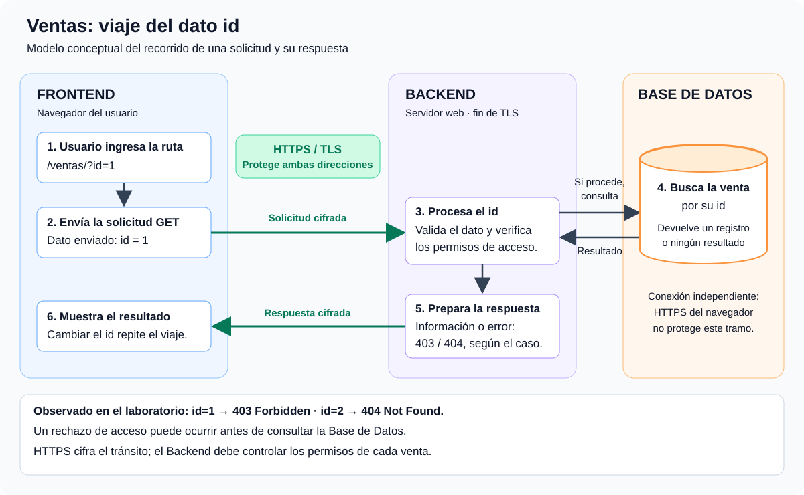

# Objetivo 1: Mapeo Lógico

## Descripción

La aplicación web elegida fue **Ventas**, utilizada en un entorno de práctica de Software Seguro. El objetivo es representar cómo viaja el identificador de una venta (`id`) desde el navegador hasta el Backend y la Base de Datos, e identificar el tramo protegido por HTTPS.

## Desarrollo

### Experiencia en el laboratorio

Ingresé a la ruta `/ventas/?id=1` y recibí una respuesta **403 Forbidden** (acceso prohibido). Luego probé `/ventas/?id=2` y obtuve **404 Not Found** (recurso no encontrado). A partir de esas respuestas, fui cambiando el valor de `id` para observar cuáles devolvían 403 y cuáles 404.

El dato que se sigue en este recorrido es el parámetro **`id`**, que indica la venta solicitada. Un 403 indica que el servidor rechaza el acceso y un 404 indica que no encuentra el recurso solicitado o no revela su existencia. Por sí solos, estos códigos no permiten asegurar si hay un registro en la Base de Datos.

### Diagrama de flujo

El siguiente diagrama representa un **modelo conceptual**: no se inspeccionó el código del servidor ni su Base de Datos. Se supone una conexión HTTPS que termina en el servidor web del Backend; la consulta y el orden de las validaciones pueden variar en la implementación real.

### Recorrido del dato paso a paso

1. **Interacción del usuario:** al abrir `/ventas/?id=1`, el navegador solicita la información asociada al identificador `1`.
2. **Envío desde el Frontend:** el navegador envía una solicitud HTTP de tipo `GET`. El parámetro `id=1` viaja en la URL de la solicitud. Si se accede mediante `https://`, esa solicitud viaja cifrada mediante TLS.
3. **Procesamiento en el Backend:** el servidor recibe la solicitud, obtiene el valor de `id`, lo valida y comprueba si el usuario tiene permiso para acceder a la información.
4. **Interacción con la Base de Datos:** si corresponde continuar, el Backend consulta la venta identificada por ese `id`. La Base de Datos devuelve el registro o indica que no hay resultados. El navegador no consulta directamente la Base de Datos.
5. **Respuesta del Backend:** el servidor interpreta el resultado y las reglas de acceso para elaborar la respuesta. Puede devolver la venta si el acceso está permitido, un 403 si rechaza el acceso o un 404 si el recurso no está disponible. Un rechazo puede ocurrir antes de consultar la Base de Datos, como muestra el diagrama.
6. **Visualización:** la respuesta vuelve al navegador, que muestra la información o el error. Al cambiar el `id`, se inicia una nueva solicitud y se repite el recorrido.

### ¿En qué tramo protege HTTPS?

**HTTPS protege el tramo entre el navegador del usuario y el servidor web donde termina la conexión TLS, tanto en la solicitud como en la respuesta.** En el modelo del diagrama, ese servidor forma parte del Backend.

La protección incluye el contenido HTTP, como la ruta `/ventas/`, el parámetro `id=1` y la respuesta del servidor, mientras viajan por la red. TLS aporta cifrado, integridad y autenticación del servidor mediante su certificado.

La conexión **Backend ↔ Base de Datos** es un tramo independiente: no queda protegida automáticamente por el HTTPS del navegador. Puede utilizar su propia conexión cifrada. Si la aplicación utiliza un proxy que termina TLS, la protección de esa conexión HTTPS llega hasta dicho proxy.

## Conclusiones

En el ejercicio de Ventas, cambiar el parámetro `id` permitió observar distintas respuestas del servidor: 403 y 404. El recorrido conceptual muestra que el navegador envía el dato, el Backend aplica las validaciones y los permisos, y la Base de Datos interviene cuando corresponde consultar la venta.

HTTPS protege los datos en tránsito entre el navegador y el servidor, pero **no impide que el usuario cambie el `id` ni reemplaza los controles de autorización del Backend**. La aplicación debe verificar los permisos para cada venta solicitada.
